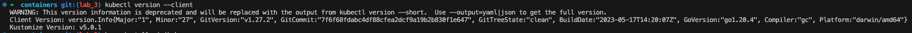
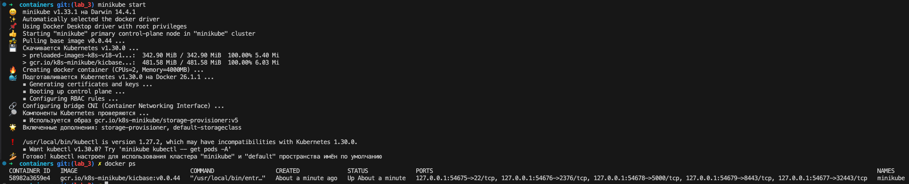
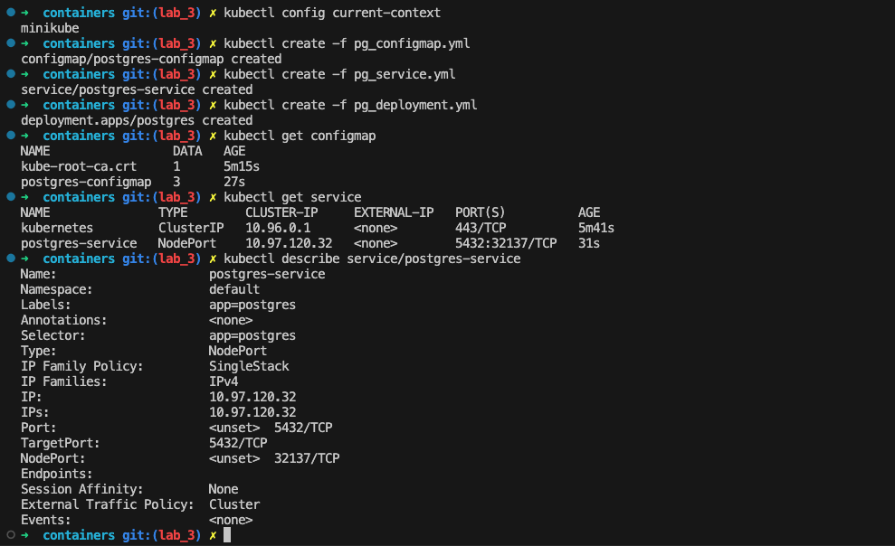
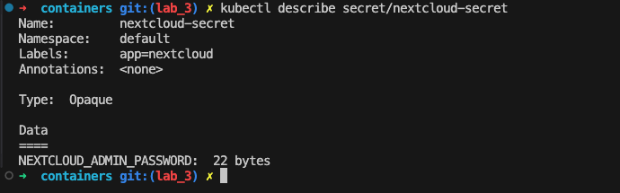
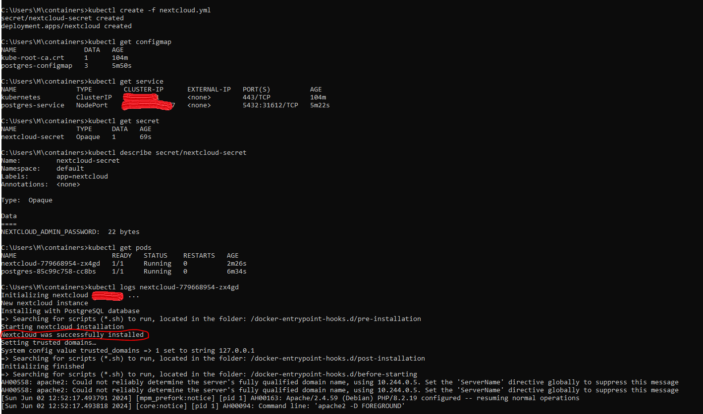
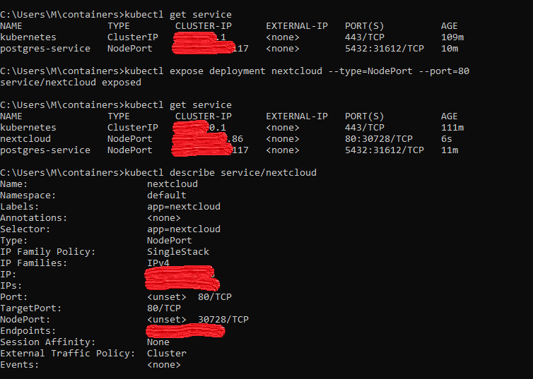
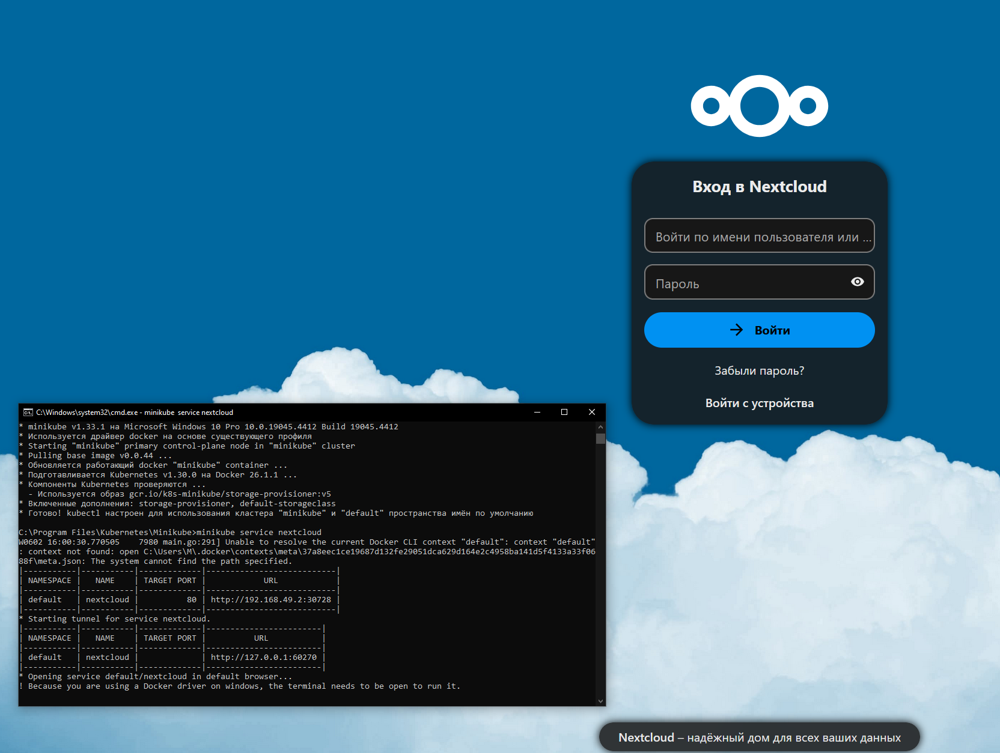
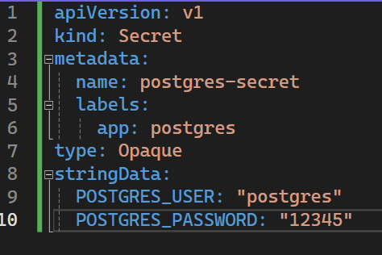
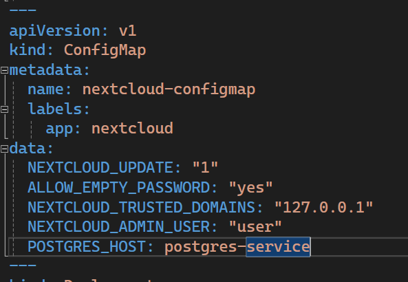
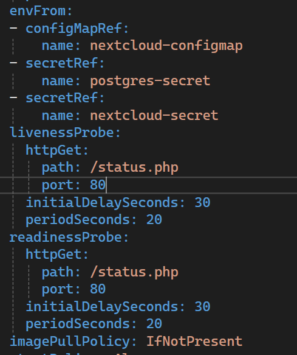

## Lab 3

### Installation 
#### kubectl
- ```brew install kubectl```
- ```kubectl version --client```
- result: 
#### minikube
- ```brew install minikube```
- ```minikube start``` 
- result: 
### Steps results 
#### kubectl describe 


#### kubectl nexcloud



#### NodePort


#### minikube


#### Задания
Для постгреса перенести POSTGRES_USER и POSTGRES_PASSWORD из конфигмапы в секреты (очевидно, понадобится новый манифест для сущности Secret)


Для некстклауда перенести его переменные (NEXTCLOUD_UPDATE, ALLOW_EMPTY_PASSWORD и проч.) из деплоймента в конфигмапу (очевидно, понадобится новый манифест для сущности ConfigMap)

Для некстклауда добавить Liveness и Readiness пробы


#### Вопрос: важен ли порядок выполнения этих манифестов? Почему?
Важен, мы можем не задеплоить если kube не узнает про сервис, конфиг мапы, секреты до того как исполнить deplyment
#### Вопрос: что (и почему) произойдет, если отскейлить количество реплик postgres-deployment в 0, затем обратно в 1, после чего попробовать снова зайти на Nextcloud? 
После того как отскейлим кол-во реплик pg-deployment, nextcloud станет недоступен, так как не будет пода pg, после возвращения обратно, nextcloud будет доступен 

